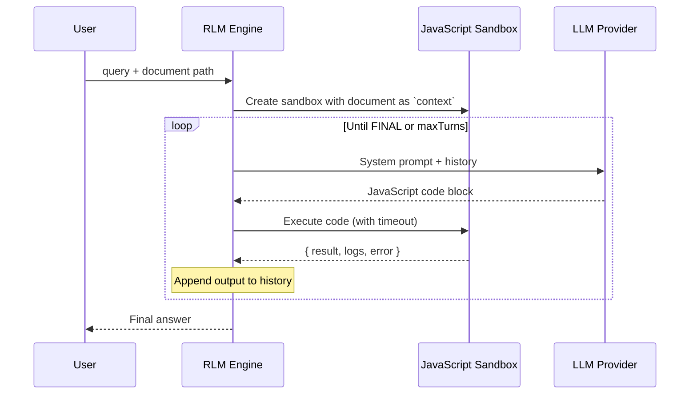

# Recursive Language Model (RLM)

Process documents 100x larger than your LLM's context window—without vector databases or chunking heuristics.

## The Problem

LLMs have fixed context windows. Traditional solutions (RAG, chunking) lose information or miss connections across chunks. RLM takes a different approach: the model writes code to explore documents programmatically, deciding at runtime how to decompose and analyze the data.

Based on the [Recursive Language Models paper](https://arxiv.org/abs/2512.24601).

## Installation

### npm (recommended)

```bash
npm install -g matryoshka-rlm
```

### npx (no install)

```bash
npx matryoshka-rlm "Summarize this document" ./document.txt
```

### From source

```bash
git clone https://github.com/yogthos/Matryoshka.git
cd Matryoshka
npm install
npm run build
```

## Configuration

Copy `config.example.json` to `config.json` and configure your LLM provider:

```json
{
  "llm": {
    "provider": "ollama"
  },
  "providers": {
    "ollama": {
      "baseUrl": "http://localhost:11434",
      "model": "qwen3-coder:30b",
      "options": { "temperature": 0.2, "num_ctx": 8192 }
    },
    "deepseek": {
      "baseUrl": "https://api.deepseek.com",
      "apiKey": "${DEEPSEEK_API_KEY}",
      "model": "deepseek-chat",
      "options": { "temperature": 0.2 }
    }
  }
}
```

## Usage

### CLI

```bash
# Basic usage
rlm "Summarize this document" ./path/to/document.txt

# With options
rlm "Find all error codes" ./logs.txt --max-turns 15 --verbose

# See all options
rlm --help
```

### MCP Integration

RLM includes an MCP (Model Context Protocol) server that exposes the `analyze_document` tool. This allows Claude to analyze documents that exceed its context window.

#### MCP Tool: `analyze_document`

| Parameter | Type | Required | Description |
|-----------|------|----------|-------------|
| `query` | string | Yes | The question or task to perform on the document |
| `filePath` | string | Yes | Absolute path to the document file |
| `maxTurns` | number | No | Maximum exploration turns (default: 10) |
| `timeoutMs` | number | No | Timeout per turn in milliseconds (default: 30000) |

#### Claude Code

Add the MCP server to Claude Code:

```bash
# Add to user config (available in all projects)
claude mcp add --transport stdio --scope user rlm -- rlm-mcp

# Or add to current project only
claude mcp add --transport stdio rlm -- rlm-mcp

# Verify it's connected
claude mcp list
```

Then ask Claude to analyze documents:

> Use the analyze_document tool to find all sales figures in /path/to/report.txt and calculate the total

#### Claude Desktop

Add to your Claude Desktop config file:

**macOS**: `~/Library/Application Support/Claude/claude_desktop_config.json`
**Windows**: `%APPDATA%\Claude\claude_desktop_config.json`

Using npx (no global install needed):

```json
{
  "mcpServers": {
    "rlm": {
      "command": "npx",
      "args": ["-y", "-p", "matryoshka-rlm", "rlm-mcp"]
    }
  }
}
```

Or if installed globally:

```json
{
  "mcpServers": {
    "rlm": {
      "command": "rlm-mcp"
    }
  }
}
```

Restart Claude Desktop after updating the config. Look for the hammer icon to confirm the server loaded.

#### Testing the MCP Server

```bash
# Verify the server starts correctly
rlm-mcp --test
# Output: MCP server ready
# Output: Available tools: analyze_document
```

### Programmatic

```typescript
import { runRLM } from "matryoshka-rlm/rlm";
import { createLLMClient } from "matryoshka-rlm";

const llmClient = createLLMClient("ollama", {
  baseUrl: "http://localhost:11434",
  model: "qwen3-coder:30b",
  options: { temperature: 0.2 }
});

const result = await runRLM("What are the main themes?", "./book.txt", {
  llmClient,
  maxTurns: 10,
  turnTimeoutMs: 30000,
});
```

## Architecture



### Components

| Component | Purpose |
|-----------|---------|
| **RLM Engine** | Orchestrates the turn loop, builds prompts, extracts answers |
| **Sandbox** | Isolated VM executing LLM-generated JavaScript with timeout protection |
| **Tools** | `text_stats()`, `fuzzy_search()`, `llm_query()` available in sandbox |
| **Memory** | Persistent array for accumulating findings across turns |

### How It Works

1. Document loads into sandbox as read-only `context` variable
2. LLM receives system prompt with available tools and writes JavaScript
3. Code executes in sandbox, results feed back to LLM
4. LLM iterates until it outputs `<<<FINAL>>>answer<<<END>>>`
5. Sub-queries via `llm_query()` enable recursive decomposition

### Sandbox Tools

The LLM has access to these tools when exploring documents:

| Tool | Description |
|------|-------------|
| `text_stats()` | Returns document metadata: length, line count, samples from start/middle/end |
| `fuzzy_search(query, limit?)` | Finds approximate matches, returns lines with scores |
| `llm_query(prompt)` | Spawns a sub-LLM call for complex analysis (limited by `maxSubCalls`) |
| `context` | The full document text (read-only string) |
| `memory` | Persistent array to accumulate findings across turns |

### Safety

- Sandbox isolates code execution (no filesystem, network, or process access)
- Configurable timeout per turn
- `maxSubCalls` limit prevents infinite recursion
- Sub-LLM calls receive only the prompt, never parent context
- Auto-fixes common syntax errors in LLM-generated code

## Troubleshooting

### Model Answers Immediately Without Exploring

**Symptom**: The model provides an answer on the first turn without running any code, often with hallucinated data.

**Cause**: Smaller or less capable models may not follow the instruction to explore via code before answering.

**Solutions**:

1. **Use a more capable model** - Models like `deepseek-chat` or larger Ollama models follow instructions better
2. **Make your query more specific** - Instead of vague queries, be explicit:
   ```bash
   # Vague (may cause hallucination)
   rlm "What are the sales figures?" ./report.txt

   # Specific (guides exploration)
   rlm "Search for SALES_DATA entries and sum the dollar amounts" ./report.txt
   ```
3. **Include data patterns in your query** - If you know how data is formatted, mention it:
   ```bash
   rlm "Find lines matching 'Total:' and extract the numbers" ./data.txt
   ```

### Max Turns Reached Without Answer

**Symptom**: Output shows "Max turns (N) reached without final answer"

**Cause**: The model keeps exploring but never terminates properly.

**Solutions**:

1. Increase `--max-turns` for complex documents
2. Check if the model is stuck in a loop (`--verbose` shows repeated patterns)
3. Simplify the query to require less exploration

### Sandbox Execution Errors

**Symptom**: Repeated "Error: Unexpected token" or similar JavaScript errors

**Cause**: The model is generating invalid JavaScript code.

**Solutions**:

1. The system auto-fixes common issues (missing semicolons, TypeScript syntax)
2. If errors persist, try a different model - some are better at generating valid code
3. Use `--verbose` to see what code the model is generating

## Development

```bash
# Run tests
npm test

# Run with coverage
npm test -- --coverage

# E2E tests (requires Ollama running locally)
RUN_E2E=1 npm test -- --run tests/e2e.test.ts

# Build
npm run build

# Type check
npm run typecheck
```

## License

MIT

## References

- [RLM Paper](https://arxiv.org/abs/2512.24601)
- [Original Implementation](https://github.com/alexzhang13/rlm)
- [Model Context Protocol](https://modelcontextprotocol.io/)
