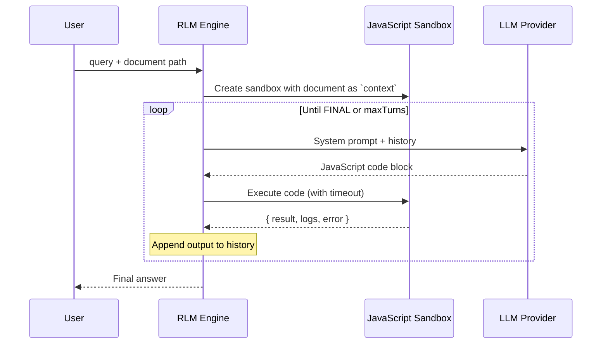

# Recursive Language Model (RLM)

Process documents 100x larger than your LLM's context window—without vector databases or chunking heuristics.

## The Problem

LLMs have fixed context windows. Traditional solutions (RAG, chunking) lose information or miss connections across chunks. RLM takes a different approach: the model writes code to explore documents programmatically, deciding at runtime how to decompose and analyze the data.

Based on the [Recursive Language Models paper](https://arxiv.org/abs/2512.24601).

## Installation

### npm (recommended)

```bash
npm install -g matryoshka-rlm
```

### npx (no install)

```bash
npx matryoshka-rlm "Summarize this document" ./document.txt
```

### From source

```bash
git clone https://github.com/yogthos/Matryoshka.git
cd Matryoshka
npm install
npm run build
```

## Configuration

Copy `config.example.json` to `config.json` and configure your LLM provider:

```json
{
  "llm": {
    "provider": "ollama"
  },
  "providers": {
    "ollama": {
      "baseUrl": "http://localhost:11434",
      "model": "qwen2.5-coder:7b",
      "options": { "temperature": 0.2, "num_ctx": 8192 }
    },
    "deepseek": {
      "baseUrl": "https://api.deepseek.com",
      "apiKey": "${DEEPSEEK_API_KEY}",
      "model": "deepseek-chat",
      "options": { "temperature": 0.2 }
    }
  }
}
```

## Usage

### CLI

```bash
# Basic usage
rlm "Summarize this document" ./path/to/document.txt

# With options
rlm "Find all error codes" ./logs.txt --max-turns 15 --verbose

# See all options
rlm --help
```

### MCP Integration

RLM includes an MCP (Model Context Protocol) server that exposes the `analyze_document` tool. This allows coding agents like [Crush](https://github.com/charmbracelet/crush) to analyze documents that exceed its context window.

#### MCP Tool: `analyze_document`

| Parameter | Type | Required | Description |
|-----------|------|----------|-------------|
| `query` | string | Yes | The question or task to perform on the document |
| `filePath` | string | Yes | Absolute path to the document file |
| `maxTurns` | number | No | Maximum exploration turns (default: 10) |
| `timeoutMs` | number | No | Timeout per turn in milliseconds (default: 30000) |

#### Crush MCP example

Add to your `crush.json` config:

```json
{
  "mcp": {
    "rlm": {
      "type": "stdio",
      "command": "rlm-mcp"
    }
  }
}
```
Then ask Crush to analyze documents:

> Use the analyze_document tool to find all sales figures in /path/to/report.txt and calculate the total

See [Crush](https://github.com/charmbracelet/crush) for more details.

#### Testing the MCP Server

```bash
# Verify the server starts correctly
rlm-mcp --test
# Output: MCP server ready
# Output: Available tools: analyze_document
```

### Programmatic

```typescript
import { runRLM } from "matryoshka-rlm/rlm";
import { createLLMClient } from "matryoshka-rlm";

const llmClient = createLLMClient("ollama", {
  baseUrl: "http://localhost:11434",
  model: "qwen2.5-coder:7b",
  options: { temperature: 0.2 }
});

const result = await runRLM("What are the main themes?", "./book.txt", {
  llmClient,
  maxTurns: 10,
  turnTimeoutMs: 30000,
});
```

> **Note**: The current Ollama implementation is tuned for `qwen2.5-coder:7b`. Other models may require prompt adjustments—see [Model-Specific Tuning](#model-specific-tuning) in Troubleshooting.

## Architecture



### Components

| Component | Purpose |
|-----------|---------|
| **RLM Engine** | Orchestrates the turn loop, builds prompts, extracts answers |
| **Sandbox** | Isolated VM executing LLM-generated JavaScript with timeout protection |
| **Tools** | `text_stats()`, `fuzzy_search()`, `llm_query()` available in sandbox |
| **Memory** | Persistent array for accumulating findings across turns |

### How It Works

1. Document loads into sandbox as read-only `context` variable
2. LLM receives system prompt with available tools and writes JavaScript
3. Code executes in sandbox, results feed back to LLM
4. LLM iterates until it outputs `<<<FINAL>>>answer<<<END>>>`
5. Sub-queries via `llm_query()` enable recursive decomposition

### Sandbox Tools

The LLM has access to these tools when exploring documents:

| Tool | Description |
|------|-------------|
| `text_stats()` | Returns document metadata: length, line count, samples from start/middle/end |
| `fuzzy_search(query, limit?)` | Finds approximate matches, returns lines with scores |
| `llm_query(prompt)` | Spawns a sub-LLM call for complex analysis (limited by `maxSubCalls`) |
| `context` | The full document text (read-only string) |
| `memory` | Persistent array to accumulate findings across turns |

### Safety

- Sandbox isolates code execution (no filesystem, network, or process access)
- Configurable timeout per turn
- `maxSubCalls` limit prevents infinite recursion
- Sub-LLM calls receive only the prompt, never parent context
- Auto-fixes common syntax errors in LLM-generated code

## Troubleshooting

### Model Answers Immediately Without Exploring

**Symptom**: The model provides an answer on the first turn without running any code, often with hallucinated data.

**Cause**: Smaller or less capable models may not follow the instruction to explore via code before answering.

**Solutions**:

1. **Use a more capable model** - Models like `deepseek-chat` or larger Ollama models follow instructions better
2. **Make your query more specific** - Instead of vague queries, be explicit:
   ```bash
   # Vague (may cause hallucination)
   rlm "What are the sales figures?" ./report.txt

   # Specific (guides exploration)
   rlm "Search for SALES_DATA entries and sum the dollar amounts" ./report.txt
   ```
3. **Include data patterns in your query** - If you know how data is formatted, mention it:
   ```bash
   rlm "Find lines matching 'Total:' and extract the numbers" ./data.txt
   ```

### Max Turns Reached Without Answer

**Symptom**: Output shows "Max turns (N) reached without final answer"

**Cause**: The model keeps exploring but never terminates properly.

**Solutions**:

1. Increase `--max-turns` for complex documents
2. Check if the model is stuck in a loop (`--verbose` shows repeated patterns)
3. Simplify the query to require less exploration

### Sandbox Execution Errors

**Symptom**: Repeated "Error: Unexpected token" or similar JavaScript errors

**Cause**: The model is generating invalid JavaScript code.

**Solutions**:

1. The system auto-fixes common issues (missing semicolons, TypeScript syntax)
2. If errors persist, try a different model - some are better at generating valid code
3. Use `--verbose` to see what code the model is generating

### Model-Specific Tuning

**Symptom**: A model that works with one provider doesn't work well with another, or a different model size behaves differently.

**Cause**: Different LLMs have varying instruction-following capabilities, code generation quality, and prompting preferences. The RLM system prompt and feedback messages are tuned for specific model behaviors.

**Why This Happens**:

- **Instruction following**: Smaller models (7B) may ignore complex instructions or take shortcuts (e.g., answering without exploring)
- **Code generation**: Some models prefer TypeScript syntax, others generate Python by mistake
- **Termination patterns**: Models differ in how they signal completion—some use `<<<FINAL>>>` correctly, others put it inside code blocks
- **Error recovery**: When code fails, some models self-correct while others repeat the same mistake

**Current Tuning**:

The Ollama provider is currently tuned for `qwen2.5-coder:7b` with these accommodations:
- Case-insensitive `grep()` to handle varying capitalization
- Detection of `<<<FINAL>>>` markers inside code blocks
- Variable persistence between turns (REPL-like state)
- Rejection of answers after code errors (forces retry)
- Fallback to console output when memory is empty

**Adapting for Other Models**:

If using a different model, you may need to adjust `src/rlm.ts`:

1. **System prompt** (`buildSystemPrompt`): Modify examples and instructions to match model's style
2. **Final answer detection** (`extractFinalAnswer`): Add patterns the model uses to signal completion
3. **Feedback messages**: Adjust error messages and hints to guide the specific model
4. **Code extraction** (`extractCode`): Some models use different code block markers

Larger models (30B+) typically need fewer accommodations as they follow instructions more reliably.

### Query Complexity and Model Capabilities

**Symptom**: The model finds the right data but produces incorrect results, or returns 0/empty when values clearly exist.

**Cause**: Smaller models (7B) can struggle to write correct parsing logic, especially for complex data formats. The model may write regex patterns that don't match the actual data format, or use flawed extraction logic.

**What Works Well** (with 7B models):

| Query Type | Example | Why It Works |
|------------|---------|--------------|
| Counting | "Count how many ERROR entries exist" | Simple `.length` on search results |
| Listing | "List all unique log levels" | Direct iteration, no parsing |
| Searching | "Find all lines containing 'timeout'" | Uses built-in `grep()` directly |
| Existence | "Does this document mention 'authentication'?" | Boolean check on results |

**What Struggles** (with 7B models):

| Query Type | Example | Why It Fails |
|------------|---------|--------------|
| Currency parsing | "Sum all dollar amounts like $1,234,567" | Model writes regex expecting decimals (`.00`) when data has none |
| Complex extraction | "Extract the reason field from each error" | Model parses wrong part of the string |
| Multi-step aggregation | "Group errors by type and count each" | Logic errors in categorization code |
| Format-sensitive parsing | "Parse the JSON in each log line" | Model assumes wrong data format |

**Solutions**:

1. **Use simpler queries** - Break complex tasks into simpler steps:
   ```bash
   # Instead of: "Sum all sales figures"
   # Use: "List all lines containing SALES_DATA"
   # Then process the output yourself
   ```

2. **Be explicit about formats** - Tell the model exactly what to expect:
   ```bash
   # Bad: "Extract the numbers"
   # Good: "Extract numbers formatted as X,XXX,XXX (no decimals, with commas)"
   ```

3. **Use a larger model** - 30B+ models write significantly better parsing code

4. **Leverage the raw output** - Even when parsing fails, the system often returns the raw matched data which you can process externally

**Example of Model Limitation**:

```bash
# Query: "Sum all SALES_DATA values"
# Data format: SALES_DATA_NORTH: $2,340,000

# Model writes: /\$\d{1,3}(,\d{3})*\.\d{2}/  (expects $1,234.56)
# Actual format: $2,340,000 (no decimals)
# Result: 0 (regex doesn't match)
```

The infrastructure correctly finds all SALES_DATA lines, but the model's regex assumes a different number format. This is a model capability issue, not an infrastructure bug.

## Development

```bash
# Run tests
npm test

# Run with coverage
npm test -- --coverage

# E2E tests (requires Ollama running locally)
RUN_E2E=1 npm test -- --run tests/e2e.test.ts

# Build
npm run build

# Type check
npm run typecheck
```

## License

MIT

## References

- [RLM Paper](https://arxiv.org/abs/2512.24601)
- [Original Implementation](https://github.com/alexzhang13/rlm)
- [Model Context Protocol](https://modelcontextprotocol.io/)
